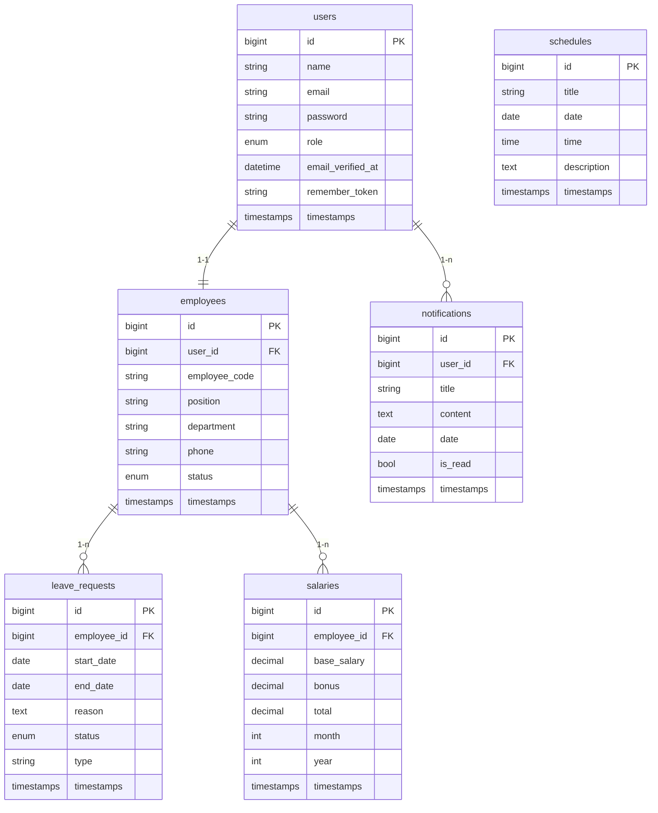
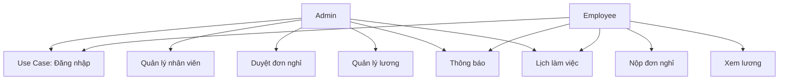

# StaffHub – Tài liệu ERD & Use Case

Tài liệu này giúp bạn nhanh chóng dựng ERD và biểu đồ Use Case/Use Case phân rã cho hệ thống StaffHub.

## 1) Thực thể & thuộc tính (ERD)

- **users**
  - id (PK), name, email (unique), password, role (admin/employee), email_verified_at, remember_token, timestamps
- **employees**
  - id (PK), user_id (FK->users), employee_code (unique), position, department, phone, status, timestamps
- **leave_requests**
  - id (PK), employee_id (FK->employees), start_date, end_date, reason, status (Chờ duyệt/Đã duyệt/Từ chối), type, timestamps
- **salaries**
  - id (PK), employee_id (FK->employees), base_salary, bonus, total, month, year, timestamps
- **notifications**
  - id (PK), user_id (FK->users), title, content, date, is_read, timestamps
- **schedules**
  - id (PK), title, date, time, description, timestamps

### Quan hệ chính
- users 1–1 employees (user có đúng một hồ sơ employee)
- users 1–n notifications
- employees 1–n leave_requests
- employees 1–n salaries

### Đề xuất vẽ ERD (Mermaid)
Sao chép vào tool Mermaid (hoặc VS Code extension Mermaid) để tạo sơ đồ:



### Đề xuất vẽ ERD (dbdiagram.io)

```sql
Table users {
  id bigint [pk]
  name varchar
  email varchar [unique]
  password varchar
  role varchar
  email_verified_at datetime
  remember_token varchar
  created_at timestamp
  updated_at timestamp
}

Table employees {
  id bigint [pk]
  user_id bigint [ref: > users.id]
  employee_code varchar [unique]
  position varchar
  department varchar
  phone varchar
  status varchar
  created_at timestamp
  updated_at timestamp
}

Table leave_requests {
  id bigint [pk]
  employee_id bigint [ref: > employees.id]
  start_date date
  end_date date
  reason text
  status varchar
  type varchar
  created_at timestamp
  updated_at timestamp
}

Table salaries {
  id bigint [pk]
  employee_id bigint [ref: > employees.id]
  base_salary decimal
  bonus decimal
  total decimal
  month int
  year int
  created_at timestamp
  updated_at timestamp
}

Table notifications {
  id bigint [pk]
  user_id bigint [ref: > users.id]
  title varchar
  content text
  date date
  is_read boolean
  created_at timestamp
  updated_at timestamp
}

Table schedules {
  id bigint [pk]
  title varchar
  date date
  time time
  description text
  created_at timestamp
  updated_at timestamp
}
```

## 2) Use Case tổng quan

**Actors:** Admin, Employee, Hệ thống Email/Notification (optional), Hệ thống Payroll (optional).

**Danh sách use case chính:**
1. Đăng nhập/Đăng xuất (Admin, Employee)
2. Xem dashboard (Admin, Employee)
3. Quản lý nhân viên (CRUD) (Admin)
4. Quản lý đơn nghỉ phép (duyệt/từ chối) (Admin)
5. Xem danh sách nhân viên (Employee – read only)
6. Nộp đơn nghỉ phép (Employee)
7. Xem trạng thái đơn (Employee)
8. Xem thông báo (Admin, Employee)
9. Xem lịch làm việc (Admin, Employee)
10. Xem bảng lương (Admin: tất cả, Employee: của mình)
11. Quản lý lương (tạo/cập nhật) (Admin)
12. Cập nhật thông tin cá nhân, đổi mật khẩu (Employee; Admin cho mọi user)

## 3) Use Case phân rã (gợi ý)

### 3.1 Đăng nhập
- Nhập email/password
- Xác thực (Sanctum)
- Nhận token + thông tin role
- Điều hướng theo role (Admin -> Admin dashboard; Employee -> Employee dashboard)

### 3.2 Quản lý nhân viên (Admin)
- Tạo nhân viên mới (tạo user + employee + code)
- Cập nhật thông tin nhân viên
- Đổi trạng thái làm việc (Đang làm việc/Nghỉ việc)
- Xóa nhân viên (soft delete nếu cần; hiện tại đang hard delete)
- Tìm kiếm/lọc theo phòng ban, trạng thái

### 3.3 Quản lý đơn nghỉ phép (Admin)
- Xem danh sách đơn (lọc theo trạng thái)
- Duyệt hoặc Từ chối
- Gửi thông báo cho nhân viên

### 3.4 Nộp đơn nghỉ phép (Employee)
- Nhập ngày bắt đầu/kết thúc, lý do, loại
- Gửi đơn
- Nhận thông báo khi duyệt/từ chối

### 3.5 Bảng lương
- Admin: tạo/cập nhật lương cho nhân viên
- Employee: xem lịch sử lương của mình

### 3.6 Thông báo
- Hệ thống tạo thông báo (duyệt đơn, nhắc hạn báo cáo, lịch họp)
- Người dùng xem và đánh dấu đã đọc

### 3.7 Lịch làm việc (Schedules)
- Admin thêm lịch (meeting, deadline, training)
- Employee xem lịch

## 4) Hướng dẫn vẽ Use Case diagram (Mermaid)



(Flowchart Mermaid không phải chuẩn Use Case UML, nhưng đủ để hình dung actors ↔ use cases. Bạn có thể chuyển sang PlantUML nếu cần ký pháp UML chuẩn.)

## 5) Gợi ý Use Case phân rã chi tiết (text tree)

- Quản lý nhân viên (Admin)
  - Tạo nhân viên
  - Cập nhật thông tin
  - Đổi trạng thái làm việc
  - Xóa nhân viên
  - Tìm kiếm/Lọc

- Quản lý đơn nghỉ (Admin)
  - Xem danh sách
  - Duyệt/Từ chối
  - Gửi thông báo

- Nộp đơn nghỉ (Employee)
  - Chọn ngày
  - Nhập lý do
  - Gửi đơn
  - Nhận phản hồi

- Quản lý lương (Admin)
  - Nhập lương cơ bản
  - Nhập thưởng
  - Tính tổng
  - Lưu/xuất (PDF/Excel – optional)

- Xem lương (Employee)
  - Xem lịch sử tháng
  - Xem tổng lương

- Thông báo (Admin/Employee)
  - Xem danh sách
  - Đánh dấu đã đọc

- Lịch làm việc (Admin/Employee)
  - Tạo lịch (Admin)
  - Xem lịch (Employee)

## 6) Mapping UI ↔ Use Case (tham chiếu mock)
- LoginView → Đăng nhập
- Dashboard (Admin/Employee) → Xem thống kê, thông báo, lịch
- Employees list (Admin) → Quản lý nhân viên
- Leave requests (Admin) → Duyệt đơn
- My leaves (Employee) → Nộp đơn nghỉ, Xem trạng thái
- Salary (Admin/Employee) → Quản lý/Xem lương
- Notifications → Xem thông báo
- Schedule → Xem lịch làm việc

## 7) Lưu ý khi hiện thực hóa ERD
- Ràng buộc ngoại khóa đã có trong migrations (cascade on delete cho employees, leave_requests, salaries, notifications).
- Enum trạng thái được dùng cho status trong leave_requests và employees (chuẩn hóa theo UI: “Đang làm việc”, “Nghỉ việc”; “Chờ duyệt”, “Đã duyệt”, “Từ chối”).
- Thêm index nếu cần truy vấn nhiều (email, employee_code, status, month/year).
- Consider soft deletes nếu muốn khôi phục (chưa bật trong migrations hiện tại).
